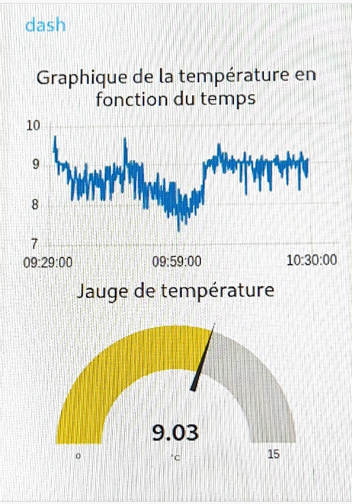
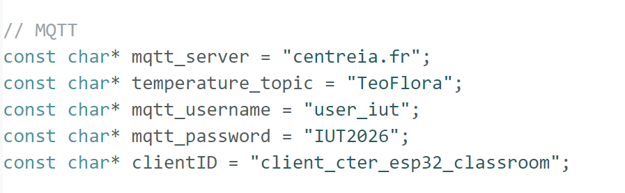
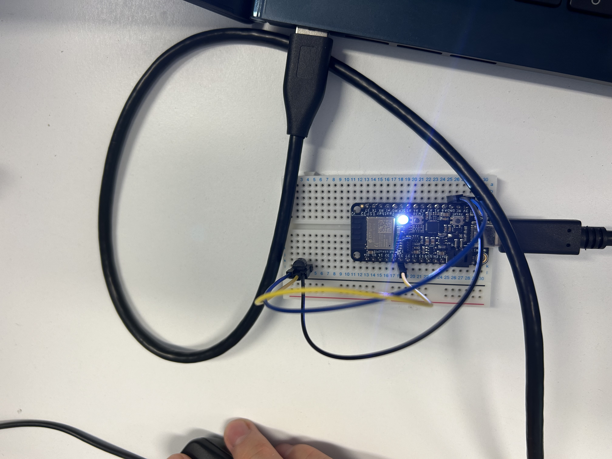

Projet Physique avancée 

# Rapport de projet : Système de Surveillance de Température avec ESP32 

Realiser par : Téo BARATHIER et Flora GOICOECHEA

Encadrant: Monsieur GOUDOT
 
## Sommaire

- Introduction
- Schéma d’architecture
- Matériel utilisé
- Acquisition et transmission des données
- Stockage et exploitation des données
- Affichage et interface utilisateur
- Sécurisation et fiabilité
- Alertes et automatisation
- Conclusion


## Introduction

L’objectif est de concevoir un système de surveillance de la température en utilisant un capteur LM35, un ESP32, un Raspberry Pi et le protocole MQTT. Les données seront transmises au Raspberry Pi via Mosquitto, stockées dans une base de données SQLite et affichées en temps réel à l’aide de Node-RED.

## 1. Schéma d’architecture

## 2. Matériel utilisé

- Capteur LM35 : capteur analogique de température délivrant une tension proportionnelle à la température.

- ESP32 : microcontrôleur chargé de l’acquisition des données, du traitement et de la communication avec le broker MQTT du Centre IA.

- Raspberry Pi : ordinateur monocarte utilisé pour le stockage des données, l’exécution de Node-RED et l’exploitation des informations reçues.

## 3.Acquisition et transmission des données

La température est mesurée à l’aide du capteur analogique LM35, connecté à l’entrée analogique 33 de l’ESP32. Le capteur fournit une tension proportionnelle à la température ambiante.

<p align="center">
	
</p>

L’ESP32 convertit cette tension en valeur numérique, puis calcule la température en degrés Celsius.

Voici le script Arduino permettant de lire la température du capteur LM35 sur l’ESP32.

```bash
void setup()
{
Serial.begin(9600); // initialise sortie console
}
void loop()
{
int raw = analogRead(33); // entrée analog 2 de l’ESP (need PinMap)
Serial.print("raw : ");
Serial.println(raw);
float volts = (float)raw*5/4095; // il faut forcer volt a être un float sinon la division renvoie un int (donc 0 au lieu de 0.2)
Serial.print("volts : ");
Serial.println(volts);
float degres;
degres = volts/0.01;
Serial.print("degres : ");
Serial.println(degres);
delay(2000);
}
```


Après le calcul, la température est publiée par l’ESP32 sur un topic MQTT. Ces valeurs sont envoyées au broker MQTT du Centre IA. Dès qu’un message est publié par l’ESP32, il est automatiquement reçu par le Raspberry Pi. La fréquence d’envoi des mesures est contrôlée afin de minimiser la consommation électrique.


Pour connecter l’ESP32 au Wi-Fi et le relier à Node-RED, nous utilisons le programme Arduino suivant :

```bash 
#include <WiFi.h> // Enables the ESP32 to connect to the local network (via WiFi)
#include <PubSubClient.h> // Connect and publish to the MQTT broker
// WiFi
const char* ssid = "LoraChoco"; // Your personal network SSID
const char* wifi_password = "MRB3HBM0R28"; // Your personal network password
// MQTT
const char* mqtt_server = "centreia.fr"; // IP of the MQTT broker
const char* temperature_topic = "TeoFlora";
const char* mqtt_username = "username"; // MQTT username
const char* mqtt_password = "password"; // MQTT password
const char* clientID = "client_cter_esp32_classroom"; // MQTT client ID
// Initialise the WiFi and MQTT Client objects
// Initialise the WiFi and MQTT Client objects
WiFiClient wifiClient;
// 1883 is the listener port for the Broker
PubSubClient client(mqtt_server, 1883, wifiClient); 
// Custom function to connet to the MQTT broker via WiFi
void connect_MQTT(){
// Connect to MQTT Broker
// client.connect returns a boolean value to let us know if the connection was successful.
// If the connection is failing, make sure you are using the correct MQTT Username and Password (Setup Earlier in the Instructable)
if (client.connect(clientID)) {
 Serial.println("Connected to MQTT Broker!");
}
else {
 Serial.println("Connection to MQTT Broker failed...");
}
}
void setup() {
Serial.begin(9600);
// Oublie de l'ancienne config Wifi
WiFi.disconnect(true);
delay(1000);
WiFi.mode(WIFI_STA); // mode station
// Connect to Wifi
Serial.print("Connecting to ");
Serial.println(ssid);
WiFi.begin(ssid, wifi_password);
// Wait until the connection has been confirmed before continuing
while (WiFi.status() != WL_CONNECTED) {
 delay(500);
 Serial.print(".");
}
// Debugging - Output the IP Address of the ESP32
Serial.println("WiFi connected");
Serial.print("IP address: ");
Serial.println(WiFi.localIP());
}
void loop() {
connect_MQTT();
Serial.setTimeout(2000);
int raw = analogRead(33);
Serial.print("raw : ");
Serial.println(raw);
float volts = (float)raw*3.3/4095; // il faut forcer volt a être un float sinon la division renvoie un int (donc 0 au lieu de 0.2)
Serial.print("volts : ");
Serial.println(volts);
float degres = volts/0.01;
Serial.print("degres : ");
Serial.println(degres);
// MQTT can only transmit strings
String temperature_string = String(degres);
// PUBLISH to the MQTT Broker (topic = Temperature, defined at the beginning)
if (client.publish(temperature_topic, temperature_string.c_str())) {
 Serial.println("Temperature sent!");
}
// client.publish will return a boolean value depending on whether it succeded or not.
// If the message failed to send, we will try again, as the connection may have broken.
else {
 Serial.println("Temperature failed to send. Reconnecting to MQTT Broker and trying again");
 client.connect(clientID, mqtt_username, mqtt_password);
 delay(10); // This delay ensures that client.publish doesn't clash with the client.connect call
 client.publish(temperature_topic, temperature_string.c_str());
}
client.disconnect(); // disconnect from the MQTT broker
delay(1000*10); // print new values every 10 seconds
}
```


## 3. Stockage et exploitation des données

Les données reçues par le Raspberry Pi via le broker MQTT du Centre IA sont stockées dans une base de données SQLite.
Pour cela, nous installons SQLite à l’aide de la commande suivante :

```bash 
sudo apt install sqlite3
```

Ensuite, la commande ls permet de vérifier les fichiers présents, et la commande pwd permet d’identifier le répertoire courant. Dans notre cas, le répertoire utilisé est

```bash 
/home/teo
```

Cela nous permet de paramétrer le bloc SQLite de Node-RED avec la base de données suivante :

```bash 
/home/teo/ma_base.db
```
Les valeurs sont affichées en temps réel dans la console de Node-RED ainsi que sur le Raspberry Pi.
Nous ajoutons ensuite une commande permettant d’enregistrer les données dans un fichier au format CSV.


## 4. Affichage et interface utilisateur

Node-RED est utilisé pour l’affichage des données en temps réel. Cet outil permet d’afficher la température instantanée ainsi que de tracer un graphique représentant l’évolution de la température en fonction du temps.

Sur Node-RED, nous réalisons le schéma suivant :

Les blocs utilisés sont les suivants :

- Fonction : permet de définir le contenu des messages ; dans notre cas, ce bloc traite les valeurs du capteur en temps réel.
- MQTT : configuré avec le broker du Centre IA ; le nom du topic est personnalisé (TeoFlora).
- SQLite database : base de données située à l’emplacement /home/teo/ma_base.db.
Deux blocs Debug : permettent de visualiser en temps réel les messages qui circulent dans le flux.
- Une jauge : affiche la température instantanée.
- Un graphique : représente l’évolution de la température dans le temps. Un groupe est défini afin d’afficher la jauge et le graphique sur la même page
 

On obtient le graphique et la jauge suivante qui évolue en temps réelle 
<p align="center">
	
</p>


## 5. Sécurisation et fiabilité

On a ajouter une authentification MQTT dans le programme  

<p align="center">
	
</p>


## 6. Alertes et automatisation

La led s'allume lorsque esp 32 envoyer la valeur au mqtt
<p align="center">
	
</p>

On place un systeme d'alerte grace au schema suivant: 


Cela nous permet de recevoir un message sur discord lorsque la valeur est trop haute c'est a dire lorsqu'elle dépasse les 20 degres 


<p align="center">
	
</p>

On place un systeme d'alerte grace au schema suivant: 


## Conclusion
Bilan du projet