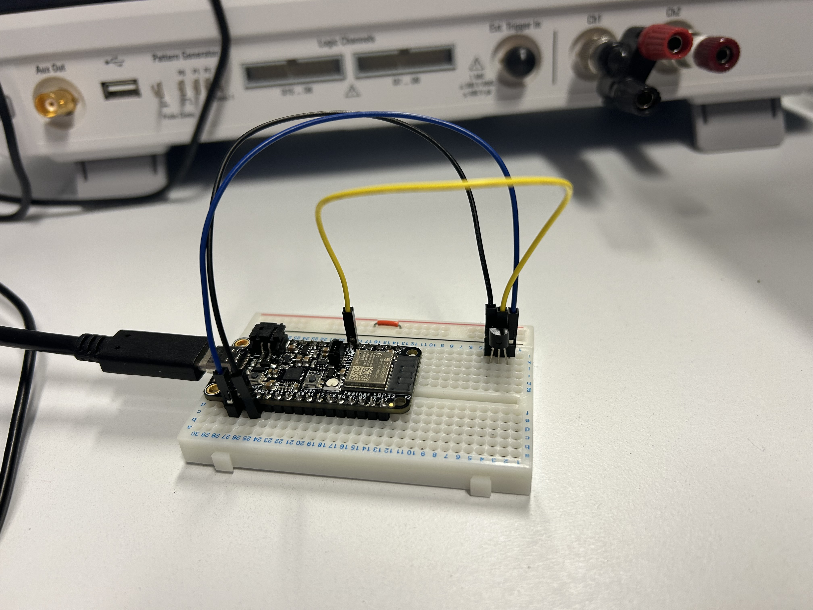

Projet Physique avancée 

# Rapport de projet : Système de Surveillance de Température avec ESP32 

Realiser par : Téo BARATHIER et Flora GOICOECHEA

Encadrant: Monsieur GOUDOT
 


## Sommaire 


## Introduction

L'objectif est de concevoir un système de surveillance de température en utilisant un capteur LM35, un ESP32, un Raspberry Pi, et le protocole MQTT. Les données seront transmises au Raspberry Pi via Mosquitto, stockées dans une base de données SQLite, et affichées en temps réel via Node-RED.

## 1. Schéma d’architecture


## 2. Acquisition et Transmission des Données

La température est mesurée à l’aide du capteur analogique LM35, connecté à l'entrée analogique 33 de l’ESP32. Le capteur fournit une tension proportionnelle à la température ambiante.

<p align="center">
	
</p>

L’ESP32 convertit cette tension en valeur numérique, puis calcule la température en degrés Celsius

Voici le script Arduino pour lire la temperature du capteur LM35 sur ESP 32

```bash
void setup()
{
Serial.begin(9600); // initialise sortie console
}
void loop()
{
int raw = analogRead(33); // entrée analog 2 de l’ESP (need PinMap)
Serial.print("raw : ");
Serial.println(raw);
float volts = (float)raw*5/4095; // il faut forcer volt a être un float sinon la division renvoie un int (donc 0 au lieu de 0.2)
Serial.print("volts : ");
Serial.println(volts);
float degres;
degres = volts/0.01;
Serial.print("degres : ");
Serial.println(degres);
delay(2000);
}
```

## 3. Stockage et Exploitation des Données

Pour stocker les donnes on utilise SQLite 

## 4.Affichage et interface utilisateur

Pour afficher les donner dans une graphique on utilise node red pour reussir on utilise centre IA pour reliser la carte ESP32 a node red
On utilise Node-RED comme outil pour afficher les données en temps réel. Cela va permettre d'afficher la temperature en instantané et de tracer un graphique qui représente l'evolution de la temperature en fonction du temps 

Sur node red on realise le schema suivant : 

avec les blocs : 
- SQLite

-Debug


Pour connecter notre esp32 au wifi et pour le relier a node red on utilise le programme Arduino suivant : 
```bash 
#include <WiFi.h> // Enables the ESP32 to connect to the local network (via WiFi)
#include <PubSubClient.h> // Connect and publish to the MQTT broker
// WiFi
const char* ssid = "LoraChoco"; // Your personal network SSID
const char* wifi_password = "MRB3HBM0R28"; // Your personal network password
// MQTT
const char* mqtt_server = "centreia.fr"; // IP of the MQTT broker
const char* temperature_topic = "TeoFlora";
const char* mqtt_username = "username"; // MQTT username
const char* mqtt_password = "password"; // MQTT password
const char* clientID = "client_cter_esp32_classroom"; // MQTT client ID
// Initialise the WiFi and MQTT Client objects
// Initialise the WiFi and MQTT Client objects
WiFiClient wifiClient;
// 1883 is the listener port for the Broker
PubSubClient client(mqtt_server, 1883, wifiClient); 
// Custom function to connet to the MQTT broker via WiFi
void connect_MQTT(){
// Connect to MQTT Broker
// client.connect returns a boolean value to let us know if the connection was successful.
// If the connection is failing, make sure you are using the correct MQTT Username and Password (Setup Earlier in the Instructable)
if (client.connect(clientID)) {
 Serial.println("Connected to MQTT Broker!");
}
else {
 Serial.println("Connection to MQTT Broker failed...");
}
}
void setup() {
Serial.begin(9600);
// Oublie de l'ancienne config Wifi
WiFi.disconnect(true);
delay(1000);
WiFi.mode(WIFI_STA); // mode station
// Connect to Wifi
Serial.print("Connecting to ");
Serial.println(ssid);
WiFi.begin(ssid, wifi_password);
// Wait until the connection has been confirmed before continuing
while (WiFi.status() != WL_CONNECTED) {
 delay(500);
 Serial.print(".");
}
// Debugging - Output the IP Address of the ESP32
Serial.println("WiFi connected");
Serial.print("IP address: ");
Serial.println(WiFi.localIP());
}
void loop() {
connect_MQTT();
Serial.setTimeout(2000);
int raw = analogRead(33);
Serial.print("raw : ");
Serial.println(raw);
float volts = (float)raw*3.3/4095; // il faut forcer volt a être un float sinon la division renvoie un int (donc 0 au lieu de 0.2)
Serial.print("volts : ");
Serial.println(volts);
float degres = volts/0.01;
Serial.print("degres : ");
Serial.println(degres);
// MQTT can only transmit strings
String temperature_string = String(degres);
// PUBLISH to the MQTT Broker (topic = Temperature, defined at the beginning)
if (client.publish(temperature_topic, temperature_string.c_str())) {
 Serial.println("Temperature sent!");
}
// client.publish will return a boolean value depending on whether it succeded or not.
// If the message failed to send, we will try again, as the connection may have broken.
else {
 Serial.println("Temperature failed to send. Reconnecting to MQTT Broker and trying again");
 client.connect(clientID, mqtt_username, mqtt_password);
 delay(10); // This delay ensures that client.publish doesn't clash with the client.connect call
 client.publish(temperature_topic, temperature_string.c_str());
}
client.disconnect(); // disconnect from the MQTT broker
delay(1000*10); // print new values every 10 seconds
}
```


## Conclusion
Bilan du projet